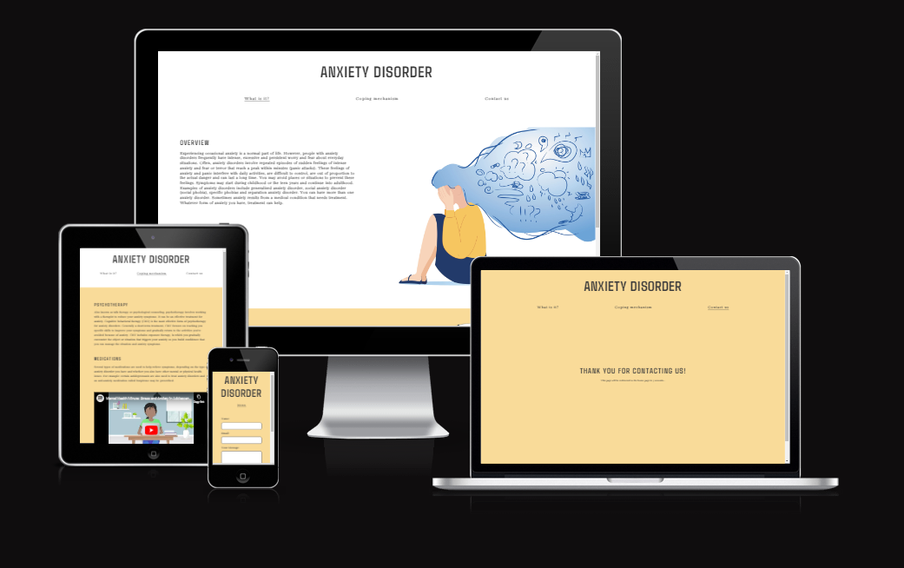
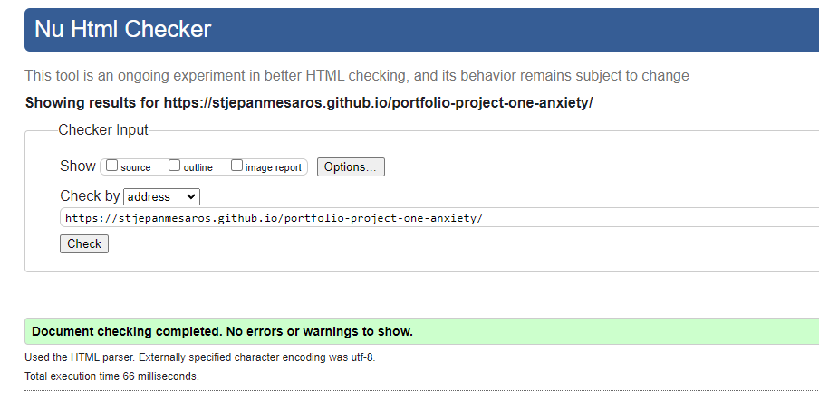
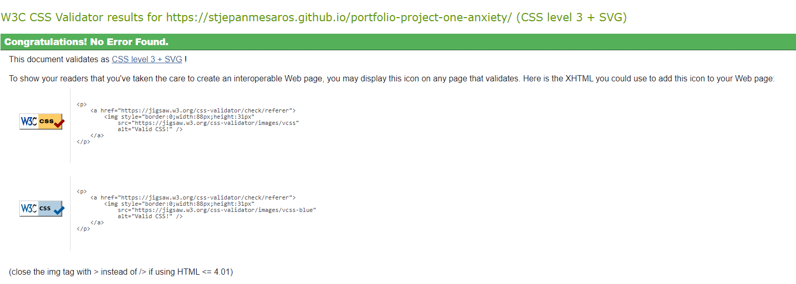

<h1 align="center">Anxiety Website</h1>

[View the live website here.](https://stjepanmesaros.github.io/portfolio-project-one-anxiety/)

## Project Rationale
This is an educational and informative website concerning Anxiety; one of highly spread out mental health illnesses. The website specifically aims to inform it's viewers about what exactly is anxiety and how we can essentially cope with it. Visitors are presented with an array of helplines ready for them with just a click away located in the footer of every page. For visitors convenience a "Contact Us" page was created as well that will allow them to get in touch if they need any extra information or help.

<h2 align="center"></h2>

## CONTENTS

* [User Experience](#user-experience-ux)
  * [User Stories](#user-stories)

* [Design](#design)
  * [Colour Scheme](#colour-scheme)
  * [Typography](#typography)
  * [Imagery](#imagery)
  * [Wireframes](#wireframes)

* [Features](#features)
  * [General Features on Each Page](#general-features-on-each-page)
  * [Future Implementations](#future-implementations)
  * [Accessibility](#accessibility)

* [Technologies Used](#technologies-used)
  * [Languages Used](#languages-used)
  * [Frameworks, Libraries & Programs Used](#frameworks-libraries--programs-used)

* [Deployment & Local Development](#deployment--local-development)
  * [Deployment](#deployment)
  * [Local Development](#local-development)
    * [How to Fork](#how-to-fork)
    * [How to Clone](#how-to-clone)

* [Testing](#testing)

* [Credits](#credits)
  * [Code Used](#code-used)
  * [Content](#content)
  * [Media](#media)
  * [Acknowledgments](#acknowledgments)

## User Experience (UX)

-   ### User stories

    -   #### First Time Visitor Goals

        -   As a First Time Visitor, I want to easily understand the main purpose of the site and learn more about anxiety.
        -   As a First Time Visitor, I want to be able to easily navigate throughout the site to find content.

    -   #### Returning Visitor Goals

        -   As a Returning Visitor, I want to refresh my information about mental health.
        -   As a Returning Visitor, I want to find new and updated information.

-   ### Design
    -   #### Colour Scheme
        -   The color pallete used incorporates warm and calming colors to easily introduce the visitor with the website. Section background yellow color matches the color of the home page main picture.
    -   #### Typography
        -   The fonts used are Agdasima for headings and Bacasime Antique for text; sans-serif as a fallback font.
    -   #### Imagery
        -   Images were chosen in regards to the topic of the website; meaning that they were chosen to be calm and stylish and artistic.   

*   ### Wireframes
    I created wireframes using the wireframe [Balsamiq](https://balsamiq.com/wireframes/desktop/#) website. .

    The website has 3 pages, namely Home page, Coping mechanisms page and a Contact page. The website is also linked to a confirmation page, which show as a "Thank you" note to the visitor after filling out the textinputs and pressing the submit button of the contact form.

    Here are the wireframes for each page:
    -   [Home Page](assets/images/wireframe-1.png)
    -   [Coping Mechanisms Page](assets/images/wireframe-2.png)
    -   [Contact Us Page](assets/images/wireframe-3.png)
    -   [Thank You Page](assets/images/wireframe-4.png)
## Features

-   ### All Pages
    -   #### Navbar
        -   The Navbar offers up three links to help the user navigate through the site.
    -   #### Footer
        -   The footer offers an array of helpline links to respective websites that can help a visitor in need.

-   ### Home page
    -   Home page has two sections to it; first one aims to quickly inform what is anxiety and the second section aims to help visitors understand what can cause anxiety.

-   ### Coping Mechanism page
    -   Coping mechanism page offers two ways to deal with anxiety and it also features a captivating one minute video that aims to educated viewer about mental health in on eminute.

-   ### Contact page
    -   Contact page features a form that a visitor can fill out and submit which would contact the site owner with the query.

## Technologies Used

### Languages Used

-   [HTML5](https://en.wikipedia.org/wiki/HTML5)
-   [CSS3](https://en.wikipedia.org/wiki/Cascading_Style_Sheets)

### Frameworks, Libraries & Programs Used

-   [Google Fonts:](https://fonts.google.com/)
    - Google fonts were used to import the 'Agdasima and Bacasime Antique' font into the style.css file which is used on all pages throughout the project.
-   [Git](https://git-scm.com/)
    - Git was used for version control by utilizing the Gitpod terminal to commit to Git and Push to GitHub.
-   [GitHub:](https://github.com/)
    - GitHub is used to store the projects code after being pushed from Git.
-   [Balsamiq](https://balsamiq.com/wireframes/desktop/#)
    - Balsamiq was used to create the [wireframes](#wireframes) during the design process.

## Testing

### Code Validation

The W3C Markup Validator and W3C CSS Validator Services were used to validate every page of the project to ensure there were no syntax errors in the project.

-   [W3C Markup Validator](https://jigsaw.w3.org/css-validator/#validate_by_input) - <h3 align="center"></h3>
-   [W3C CSS Validator](https://jigsaw.w3.org/css-validator/#validate_by_input) - <h3 align="center"></h3>

### Accessibility Test
To test the accessibility of the website [WAVE](https://wave.webaim.org/report#/https://stjepanmesaros.github.io/portfolio-project-one-anxiety/) was used.

- [WAVE Results](assets/images/accessibility-report.png)

### Performance Test
To test the performance of the website, Lighthouse testing for mobile and desktop was performed.

- [Mobile Results](assets/images/lighthouse-test-mobile.png)
- [Desktop Results](assets/images/lighthouse-test-desktop.png)

### Further Testing

-   The Website was tested on Google Chrome, Internet Explorer, Microsoft Edge and Safari browsers.
-   The website was viewed on a variety of devices such as Desktop, Laptop, 4K Screen, iPhone 13 Pro Max & iPad.
-   A large amount of testing was done to ensure that all pages were linking correctly.
-   Friends and family members were asked to review the site and documentation to point out any bugs and/or user experience issues.

### Bugs

## Known Bugs

-   Contact form does not actually send an email enquiry to anyone it just prompts a message as a thank you note.

## Fixed Bugs

-   Navigation bar would display a drop down menu after pressing any of the links while I was trying to set up a working dropdown menu. [View](assets/images/navigation-bar-bug.png) 
    That was fixed by making the hover class display it as a flex so that it would appear properly. [View](assets/images/navigation-bar-bug-fix.png)

-   Images from section one and two of the home page were not resizing with the window therefore they were making the text appear disproportionate. [View Image 1](assets/images/image-one-bug.png) [View Image 2](assets/images/image-two-bug.png)
    Solution was to add images into separate divs of their own and set their max-width and auto height; from there I just had to position them. [View Image 1 Fix](assets/images/image-one-bug-fix.png) [View Image 2 Fix](assets/images/image-two-bug-fix.png)

## Deployment

### GitHub Pages

The project was deployed to GitHub Pages using the following steps:

1. Log in to GitHub and locate the GitHub Repository
2. At the top of the Repository (not top of page), locate the "Settings" Button on the menu.
3. Scroll down the Settings page until you locate the "GitHub Pages" Section.
4. Under "Source", click the dropdown called "None" and select "Master Branch".
5. The page will automatically refresh.
6. Scroll back down through the page to locate the now published site in the "GitHub Pages" section.

## SEO
To improve the search engine optimisation (SEO) of the website:

- We added keywords in a meta tags to each html file. The keywords were researched using [WordTracker](https://www.wordtracker.com/), there are a number of short-tail and long-tail keywords.

- The list of keywords are as follows:
    - How to deal with anxiety.
    - Illness.
    - Anxiety disorder.
    - Well-being promotion.
    - Anxiety definition.
    - Anxiety disorders.
    - Symptoms of anxiety.
    - Social anxiety disorder.
    - What is anxiety.
    - Generalized anxiety disorder.
    - Social anxiety.
    - Anxiety disorder.
    - Anxiety.

## Credits

### Code

-   All code came from the developer.

### Content

-   All content used from [Mayo Clinic](https://www.mayoclinic.org/diseases-conditions/anxiety/symptoms-causes/syc-20350961S) .

-   Color pallet used from the borrowed [Harvard](https://www.health.harvard.edu/mind-and-mood/recognizing-and-easing-the-physical-symptoms-of-anxiety) picture.

### Media

-   Images were taken from [Freepik](https://www.freepik.com/vectors/mental-disorder) and from [Harvard Health Publishing](https://www.health.harvard.edu/mind-and-mood/recognizing-and-easing-the-physical-symptoms-of-anxiety)

-   Video was taken from [National Institute of Mental Health youtube channel](https://www.youtube.com/@NIMHgov)

### Acknowledgements

-   My Mentor for continuous helpful feedback.

-   My peers for helpful links and sharing of knowledge.